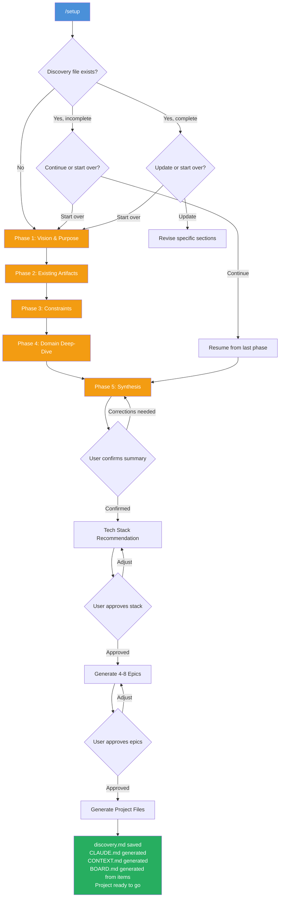
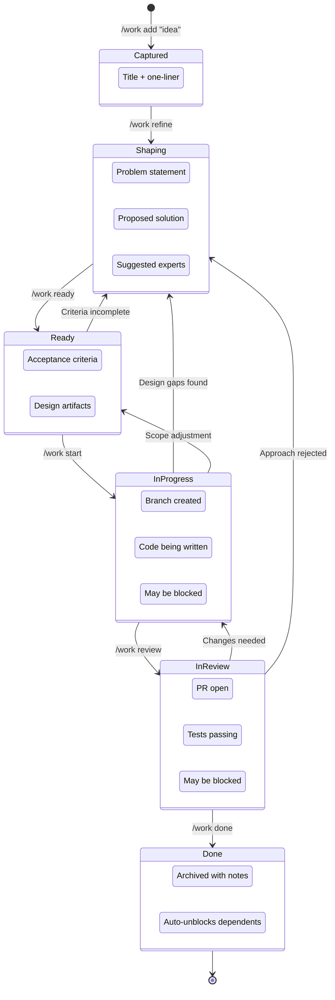
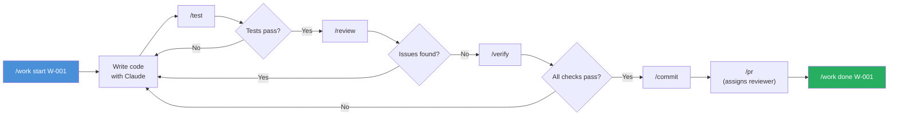
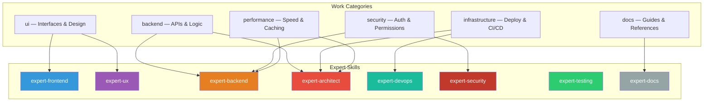
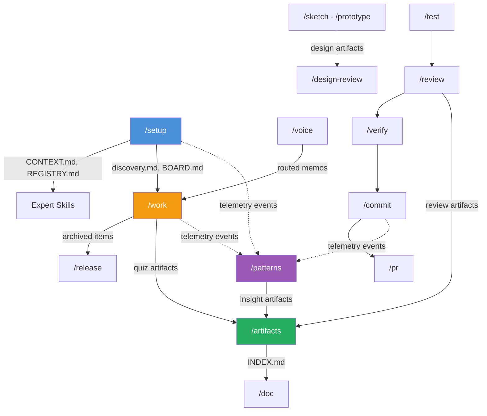
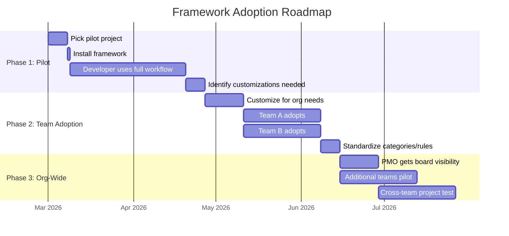

# WorkSpaceFramework

A portable, reusable Claude Code configuration framework. Drop it into any project to get governed AI-assisted development with work tracking, expert skills, and design tool integration.

## Table of Contents

- [Why It Exists](#why-it-exists)
- [What This Is](#what-this-is)
- [What Makes It Different](#what-makes-it-different)
- [What Gets Installed](#what-gets-installed)
- [How It Works](#how-it-works)
- [Core Philosophy](#core-philosophy)
- [Slash Commands](#slash-commands)
- [Expert Skills](#expert-skills)
- [Work Tracking](#work-tracking)
- [Team Features](#team-features)
- [Use Cases](#use-cases)
- [Adoption Strategy](#adoption-strategy)
- [What Comes Next](#what-comes-next)
- [What This Does NOT Replace](#what-this-does-not-replace)
- [Installation](#installation)
- [Cost and Requirements](#cost-and-requirements)
- [Updating](#updating)
- [Protecting the Framework](#protecting-the-framework)
- [Design Integration](#design-integration)
- [Project Structure](#project-structure)

## Why It Exists

AI coding assistants are powerful, but ungoverned AI is unpredictable. Without structure, Claude might start coding before you've agreed on an approach, make architectural decisions without asking, or forget everything between sessions. Every developer gets a different experience, and there's no audit trail.

WorkSpaceFramework solves this by providing a shared playbook: behavioral rules that standardize how Claude operates, expert skills that enforce best practices, and a work tracking system that captures decisions from first idea to final deploy.

## What This Is

WorkSpaceFramework provides:
- **12 behavioral rules** governing how Claude operates (governance, consultation-first, artifact-first, visual workflow, voice memos, work tracking, file organization, user interaction, documentation standards, monitoring & observability, error recovery, git guidance)
- **18 slash commands** for common workflows (work tracking, git, testing, reviews, prototyping, design, voice, monitoring, releases, artifact tracking, documentation, interaction analytics)
- **13 expert skills** (architecture, frontend, backend, UX, security, testing, devops, docs, code review, research, ideation, prototyping, verification)
- **Unified work tracking** with Kanban board and lifecycle stages
- **pencil.dev integration** for design system management
- **Voice memo workflow** for capturing ideas via speech
- **Templates** for installing into new projects

## What Makes It Different

Without the framework, Claude Code is a general-purpose assistant. It might over-build, under-communicate, or make assumptions. The framework adds:

| Without Framework | With Framework |
|---|---|
| Claude might start coding immediately | Claude discusses the approach first and waits for approval |
| No consistent work tracking | Kanban board tracks everything from ideas to completion |
| Generic AI behavior | Expert skills provide domain-specific guidance (security, UX, architecture) |
| Each developer gets different behavior | Standardized rules ensure consistency across the team |
| No design integration | pencil.dev integration for visual mockups and design systems |
| No project memory | Discovery documents and decision logs persist across sessions |

## What Gets Installed

When you run `/setup` on a project, this is what gets created:

```
YourProject/
├── CLAUDE.md                                  # Project instructions for Claude
│
├── .claude/
│   ├── settings.local.json                    # Permissions and configuration
│   │
│   ├── rules/                                 # Behavioral rules (always active)
│   │   ├── roles-and-governance.md            # Human = architect, Claude = partner
│   │   ├── consultation-first.md              # Discuss before implementing
│   │   ├── artifact-first.md                  # Show mockups before writing code
│   │   ├── user-interaction.md                # Decision framework for interactions
│   │   ├── file-organization.md               # Directory structure conventions
│   │   ├── visual-workflow.md                 # Visual design tool integration
│   │   ├── voice-memo-workflow.md             # Voice capture and processing
│   │   ├── work-system.md                     # Unified work tracking lifecycle
│   │   ├── documentation-standards.md         # When and what to document
│   │   ├── monitoring-observability.md        # When and what to monitor
│   │   ├── error-recovery.md                  # How to handle failures
│   │   └── git-guidance.md                    # Git comfort levels and error translation
│   │
│   ├── commands/                              # Slash commands
│   │   ├── setup.md                           # /setup — discovery interview
│   │   ├── work.md                            # /work — track ideas and tasks
│   │   ├── commit.md                          # /commit — git commit workflow
│   │   ├── pr.md                              # /pr — pull request creation
│   │   ├── review.md                          # /review — code review
│   │   ├── test.md                            # /test — run tests
│   │   ├── verify.md                          # /verify — full verification
│   │   ├── simplify.md                        # /simplify — reduce complexity
│   │   ├── research.md                        # /research — fast codebase search
│   │   ├── prototype.md                       # /prototype — rapid prototyping
│   │   ├── design-review.md                   # /design-review — design validation
│   │   ├── voice.md                           # /voice — voice memo processing
│   │   ├── sketch.md                          # /sketch — pencil.dev integration
│   │   ├── cronitor.md                        # /cronitor — Cronitor monitoring
│   │   ├── release.md                         # /release — changelog and releases
│   │   ├── artifacts.md                       # /artifacts — artifact registry
│   │   ├── doc.md                             # /doc — documentation routing
│   │   └── patterns.md                        # /patterns — interaction analytics
│   │
│   ├── providers/                              # Work provider routing
│   │   ├── provider.md                        # Interface contract
│   │   ├── local.md                           # Local provider (default)
│   │   ├── ado.md                             # Azure DevOps provider
│   │   └── github.md                          # GitHub provider
│   │
│   ├── skills/                                # Expert panel (specialized knowledge)
│   │   ├── REGISTRY.md                        # Skill directory
│   │   ├── CONTEXT.md                         # Project-specific tech context
│   │   │                                      #   + Team Members (opt-in)
│   │   │                                      #   + Git Workflow (opt-in)
│   │   ├── expert-architect/                  # System design & architecture
│   │   ├── expert-frontend/                   # UI & client-side
│   │   ├── expert-backend/                    # APIs & server-side
│   │   ├── expert-ux/                         # Usability & accessibility
│   │   ├── expert-testing/                    # Test strategy & QA
│   │   ├── expert-security/                   # Auth, OWASP, vulnerabilities
│   │   ├── expert-devops/                     # CI/CD, containers, infra
│   │   ├── expert-docs/                       # Documentation
│   │   ├── code-review/                       # Quality review
│   │   ├── research/                          # Fast search
│   │   ├── ideate/                            # Idea refinement
│   │   ├── prototype/                         # Rapid prototyping
│   │   └── verify-app/                        # Application verification
│   │
│   ├── work/                                  # Work tracking (kanban board)
│   │   ├── BOARD.md                           # Generated board (gitignored)
│   │   ├── items/                             # Individual work items (source of truth)
│   │   └── archive/                           # Completed items
│   │
│   ├── artifacts/                             # Implementation artifacts
│   │   └── discovery/                         # Project discovery document
│   │       └── discovery.md                   # Created during /setup
│   │
│   ├── patterns/                              # Interaction analytics
│   │   ├── sessions/                          # JSONL telemetry (gitignored)
│   │   └── insights/                          # Derived analysis artifacts
│   │
│   ├── scripts/
│   │   └── statusline.js                      # Context usage monitor
│   │
│   ├── memory/                                # Persistent decisions across sessions
│   ├── temp/                                  # Scratch work (gitignored)
│   └── voice-inbox/                           # Voice memo landing zone
```

## How It Works

### The Discovery Interview

Every project starts with `/setup` — a structured conversation where Claude learns about your project before making any technology recommendations.



### Work Item Lifecycle

Every piece of work — from a quick idea to a major feature — flows through the same stages:



### The Development Cycle

Once a work item is in progress, this is the inner loop a developer follows:



### Expert Skills: Who Gets Consulted

The framework includes 8 domain experts that Claude can draw from. Different types of work activate different experts:



### Command Data Flow

Commands produce artifacts that feed into other commands. This diagram shows the framework's interconnected data flow:



| Producer | Artifact | Consumer |
|----------|----------|----------|
| `/setup` | discovery.md, CONTEXT.md, REGISTRY.md | All skills, `/work`, `/doc` |
| `/work add` | Item file in `items/` | `/work refine`, `/work list`, BOARD.md |
| `/work refine` | Shaped item file | `/work ready`, `/work start` |
| `/work review` | Review quiz `.md` + `.meta.json` | `/artifacts`, `/work done` |
| `/work done` | Archived item, unblock scan | `/release`, dependent items |
| `/test` | Test results | `/review`, `/verify` |
| `/review` | Review artifact + `.meta.json` | `/artifacts`, `/verify` |
| `/verify` | Verification report | `/commit` |
| `/commit` | Git commit | `/pr` |
| `/pr` | Pull request | `/work done` |
| `/sketch` | Design artifact | `/design-review` |
| `/prototype` | UI prototype | `/design-review` |
| `/design-review` | Design review report | Implementation |
| `/patterns` | Session JSONL → insight artifacts | `/artifacts` |
| `/release` | Changelog, release notes, git tag | README, deployment |
| `/artifacts` | INDEX.md (generated) | `/doc`, browsing |
| `/doc` | Published documentation | External system or `docs/` |
| `/cronitor` | Monitor configuration | External monitoring |
| `/voice` | Routed memos | `/work add`, `.claude/memory/` |

## Core Philosophy

### Governance
You are the architect. Claude is your creative partner. Claude suggests and challenges but never over-executes. You should never see something you didn't expect.

### Consultation First
Claude discusses before implementing. Even explicit requests get confirmation before code changes. Slash commands are the exception -- invoking a command IS authorization.

### Artifact First
Show before you build. Non-trivial changes require a visual artifact (mockup, diagram, plan) before implementation. Iterate on the artifact, then build.

### Pure Methodology Skills
All expert skills teach principles (SOLID, OWASP, Nielsen heuristics, testing pyramids) without any tech stack baked in. Project-specific knowledge lives in CONTEXT.md, which skills read at runtime. Skills never go stale when you switch stacks.

## Slash Commands

| Command | Purpose |
|---------|---------|
| `/work` | Unified work tracking (add, list, refine, start, done) |
| `/commit` | Generate commit message and create git commit |
| `/pr` | Create pull request with auto-generated summary |
| `/test` | Run project test suite (configurable) |
| `/review` | Code review with severity levels |
| `/verify` | Full verification loop (lint, test, build, health) |
| `/simplify` | Find and remove unnecessary complexity |
| `/research` | Fast codebase search (uses Haiku) |
| `/prototype` | Rapid UI prototyping (3 fidelity levels) |
| `/design-review` | Validate against design system |
| `/voice` | Process voice memos from inbox |
| `/sketch` | pencil.dev design system integration |
| `/cronitor` | Implement Cronitor telemetry monitoring |
| `/release` | Generate changelog, bump version, create git tags |
| `/artifacts` | Query, browse, and manage artifact registry |
| `/doc` | Generate, publish, and sync project documentation |
| `/patterns` | Interaction analytics — analyze usage patterns and insights |
| `/setup` | Install, update, context refresh, or remove framework |

## Expert Skills

| Skill | Domain |
|-------|--------|
| expert-architect | System design, tech decisions, conflict resolution |
| expert-frontend | UI architecture, components, responsive design |
| expert-backend | APIs, data layer, server-side patterns |
| expert-ux | Usability, accessibility (WCAG 2.1 AA), visual design |
| expert-security | Auth, OWASP Top 10, permissions |
| expert-testing | Test strategy, coverage, test design |
| expert-devops | CI/CD, deployment, infrastructure |
| expert-docs | API docs, user guides, architecture docs |
| code-review | Quality, security, correctness review |
| research | Fast codebase search (Haiku model) |
| ideate | Work item refinement and shaping |
| prototype | Rapid UI prototyping |
| verify-app | Pre-commit/PR verification |

## Work Tracking

One system, one command. Items flow through lifecycle stages:

```
Captured → Shaping → Ready → In Progress → In Review → Done
```

```bash
/work add "Add dark mode"        # Quick capture
/work refine W-001               # Shape it with ideate skill
/work ready W-001                # Mark ready for implementation
/work start W-001                # Begin building
/work done W-001                 # Complete and archive
```

## Team Features

The framework works out of the box for a solo developer. When a team adopts it, these features activate by adding a `## Team Members` section to CONTEXT.md during `/setup`:

| Feature | What It Does | How It Activates |
|---------|-------------|------------------|
| **Work item assignment** | Assign items to team members by initials. Filter the board with `/work list @NH` or `/work list unassigned`. | `Assigned` column on BOARD.md, `**Assigned**:` field in item files. Prompt appears on `/work start` for unassigned items. |
| **PR reviewer assignment** | `/pr --reviewer NH` assigns a reviewer. Without the flag, a reviewer selection prompt appears. | Resolves initials/names to GitHub usernames from Team Members table. |
| **Branch naming conventions** | `/work start` suggests branch names matching your team's pattern (e.g., `feat/W-001-user-auth`). `/pr` validates branch names. | Reads Git Workflow section in CONTEXT.md. |
| **Voice memo attribution** | Voice memos named `2026-02-23-NH-idea.txt` are attributed to the team member when captured as work items. | Matches initials in filename against Team Members table. |
| **Structured decision memory** | `.claude/memory/` uses ADR-style entries with "Decided by" fields for team accountability. | Always available; team format encouraged when Team Members configured. |

All features are backward-compatible: without a Team Members section, the framework behaves exactly as it does for a solo developer. The `Assigned` field appears on items and board rows but stays empty, and no team-related prompts appear.

## Use Cases

### Customer-Facing Applications

Your team builds user-facing services — portals, forms, self-service applications. Each project gets set up with the framework to ensure consistent quality and documentation.

**Key value**:
- The `expert-ux` skill enforces WCAG 2.1 AA compliance and Nielsen's usability heuristics — important for services that must be accessible to all users
- The `expert-security` skill checks against OWASP Top 10 — critical for services handling personal data
- The discovery document captures the "why" behind every project, which helps when leadership asks for justification or when onboarding new team members
- Work items create a paper trail of decisions, useful for audits and institutional knowledge

### System Integrations

Your team builds integrations between internal systems, maintains custom applications, and does proactive monitoring. The framework standardizes how these projects are scoped, built, and documented.

**Key value**:
- Integration projects often have poor documentation. The framework enforces documentation as part of the workflow, not an afterthought
- The `expert-devops` skill helps with CI/CD pipelines, containerization, and infrastructure-as-code
- The `expert-architect` skill designs integration patterns while `expert-backend` guides API design and `expert-security` secures authentication between systems
- Proactive monitoring tools benefit from the same structured approach: `/setup` captures what to monitor, epics cover each monitoring layer

### Cross-Team Projects

When multiple teams collaborate on a shared project, the framework's project-scoped setup creates a common understanding.

**How it helps**:
- The discovery interview at `/setup` forces cross-team conversation at the start
- Work items can be categorized across team domains (`backend`, `infrastructure`, `security`, `ui`)
- The global board gives visibility into all active work across projects
- Expert skills provide neutral, standards-based guidance that transcends team boundaries

### Project Visibility (PMO)

The framework provides built-in project management structure without heavy bureaucracy.

**How it helps**:
- Every project starts with a discovery document — the "why" and "what" are captured before any code is written
- The kanban board (Captured, Shaping, Ready, In Progress, In Review, Done) gives natural lifecycle visibility
- Work items contain acceptance criteria, suggested experts, and decision history
- The framework can sync with Azure DevOps Boards or GitHub Issues via the work provider abstraction

### Documentation and Monitoring Standards

Projects often lack consistent documentation and monitoring. When someone leaves or a system breaks at 2 AM, the team is left guessing. The framework includes two rules that enforce standards for both.

**Documentation Standards** (`documentation-standards.md`):
- Defines **when** documentation is required — new API endpoints, architecture decisions, shipped features, breaking changes
- Sets quality criteria: audience-identified, task-oriented, working examples, current
- Establishes review cadence: docs reviewed with every PR, architecture docs reviewed quarterly for staleness

**Monitoring & Observability** (`monitoring-observability.md`):
- Defines **when** monitoring is required — scheduled jobs, external integrations, user-facing services, background workers
- Provides a decision framework: "Is it a job? Use Cronitor. Is it a service? Add a health check. Is it an integration? Track error rates."
- Sets logging standards: structured logging, clear log levels, sensitive data redaction
- Establishes monitoring tiers: critical systems get full telemetry + alerting, internal tools need structured logging at minimum

### Assessment and Accountability

Regular, honest assessment of programs requires structure. The framework creates natural checkpoints.

**How it helps**:
- `/review` provides automated code review with severity ratings (Critical, Error, Warning, Info)
- `/verify` runs full health checks — not just "does it build" but "is it healthy"
- The work archive preserves decision history: why was this built? What were the acceptance criteria? Were they met?
- Expert skills like `expert-security` and `expert-testing` provide objective, standards-based assessments rather than opinion-based ones

## Adoption Strategy



### Phase 1: Pilot (1-2 developers, 1 project)

Pick one upcoming project. Install the framework. Have the developer use `/setup` to configure the project and work through 2-3 epics using the full workflow.

**Goal**: Learn what works, what doesn't, what needs customization for your organization's needs.

**Likely customizations needed**:
- Work categories tailored to your teams (e.g., `integration`, `monitoring`, `customer-service`, `internal-tool`)
- Custom rules for organization-specific patterns (SSO integration, compliance standards, accessibility requirements)
- Custom expert skills for domain-specific needs (e.g., geospatial work, healthcare data, financial systems)

### Phase 2: Team Adoption

Development teams adopt the framework. Standardize on customized work categories and any organization-specific rules discovered during the pilot.

**Activate team features**: During `/setup`, when the discovery interview asks about team size, provide team member details. This populates the Team Members and Git Workflow sections in CONTEXT.md, which activates work item assignment, PR reviewer suggestions, branch naming conventions, and voice memo attribution.

**Goal**: Consistent AI-assisted development across teams. Shared visibility into work via the board, with assignment tracking so everyone knows who owns what.

### Phase 3: Organization-Wide Visibility

Extend to other teams that build or maintain software. The PMO gets visibility into project health through the board and discovery documents. Additional teams use the framework for software portfolio projects.

**Goal**: A common language and process for technology projects organization-wide.

## What Comes Next

Features that have been shaped, approved, and completed.

### Completed

- **Prompt pattern capture** (W-022): `/patterns` command with interaction event telemetry (JSONL sessions) and derived insight analysis. Captures command usage, skill effectiveness, decision patterns, and refinement quality. Three consumer views (individual, team, framework).
- **Documentation routing** (W-019): `/doc` command that generates, publishes, and syncs documentation via the provider abstraction (ADO Wiki, GitHub docs, local). Doc Provider config in CONTEXT.md, independent of Work Provider.
- **Artifact tracking** (W-021): Queryable registry for framework artifacts with `.meta.json` sidecars. `/artifacts` command for list, view, index, stats, and tagging.
- **Review quiz** (W-020): LLM-generated comprehension quiz during `/work review` that verifies understanding of what's being pushed. Quiz artifacts tracked in the registry.
- **`/cronitor` verification** (W-018): `status`, `verify`, and `list` subcommands for monitoring health checks and coverage audits.
- **Skill overlap boundaries** (W-016): Responsibility boundaries for overlapping skill pairs to prevent duplicated or contradictory advice.
- **Domain skill extensions** (W-017): Documented path for adding domain-specific skills via `/setup extend <domain>`.
- **Board generation from items** (W-001): BOARD.md is now a generated file — derived from individual item files. Eliminates merge conflicts and dual-write overhead.
- **`/release` command** (W-011): Generates changelog entries and release notes from completed work items, suggests version bumps, handles git tagging.
- **Support skill matrix** (W-012): All 13 skills now in the REGISTRY.md collaboration matrix with handoff patterns and escalation guidelines.
- **CONTEXT.md staleness detection** (W-013): `/setup context check` detects stale configuration and dependency mismatches. `/setup context refresh` walks through section-by-section updates.
- **Clean uninstallation** (W-015): `/setup remove` with manifest-based removal, preserving project-specific content.

## What This Does NOT Replace

- **Your team's judgment** — Claude is a partner, not a replacement. The framework explicitly designates the human as the architect with final authority on all decisions
- **Existing project management tools** — The framework integrates with Azure DevOps Boards and GitHub Issues via work providers, routing `/work` commands to the backend your team already uses. It augments these tools, not replaces them
- **Security review processes** — The `expert-security` skill adds a layer of automated checking, but doesn't replace formal security assessments for sensitive systems
- **Procurement or compliance processes** — The framework governs AI-assisted development, not organizational procurement or compliance workflows

## Installation

Three ways to install, depending on your situation:

### Option 1: One-Liner (Recommended)

No need to clone the framework repo. Run one command and the script fetches the latest version, prompts for your project directory, and installs.

**PowerShell** (recommended on Windows):

```powershell
irm https://raw.githubusercontent.com/southbendin/WorkSpaceFramework/main/install.ps1 | iex
```

**Bash** (Git Bash, WSL, macOS, Linux):

```bash
curl -fsSL https://raw.githubusercontent.com/southbendin/WorkSpaceFramework/main/install.sh | bash
```

Both scripts prompt for your target project directory, then copy rules, commands, skills, templates, providers, and scripts. They also create the work tracking structure and configure `.gitignore`.

> **Security-conscious?** Download the script first, inspect it, then run it locally:
> ```powershell
> # PowerShell
> Invoke-WebRequest -Uri https://raw.githubusercontent.com/southbendin/WorkSpaceFramework/main/install.ps1 -OutFile install.ps1
> # Review install.ps1, then:
> .\install.ps1 -TargetDir "C:\path\to\your-project"
> ```
> ```bash
> # Bash
> curl -fsSL https://raw.githubusercontent.com/southbendin/WorkSpaceFramework/main/install.sh -o install.sh
> # Review install.sh, then:
> bash install.sh /path/to/your-project
> ```

### Option 2: Local Install Script

If you've already cloned the framework repo, run the install script directly:

**PowerShell:**

```powershell
& "C:\path\to\WorkSpaceFramework\install.ps1" -TargetDir "C:\path\to\your-project"
```

**Bash:**

```bash
bash /path/to/WorkSpaceFramework/install.sh /path/to/your-project
```

Omit the target directory argument to get an interactive prompt (PowerShell shows a folder picker dialog on Windows).

### Option 3: GitHub Template (New Projects)

For greenfield projects, click the **"Use this template"** button on the [GitHub repo](https://github.com/southbendin/WorkSpaceFramework) to create a new repository with all framework files pre-installed. The template branch is automatically kept clean — no framework-internal work items or artifacts.

### After Installation: Run the Discovery Interview

Regardless of which option you used:

1. Open Claude Code in your project directory
2. Run `/setup` to start the discovery interview
3. Claude interviews you about the project, recommends a tech stack, and generates your initial roadmap

> **Note:** The install scripts refuse to run if the target is the framework repo itself or if the framework is already installed in the target.

### What You Get

After installation, your project has behavioral rules, slash commands, expert skills, a kanban board, and a discovery document — all configured for your specific project. See [What Gets Installed](#what-gets-installed) for the full file tree.

## Cost and Requirements

- **Claude Code subscription**: Required ($20/month per developer via Anthropic)
- **VS Code or Cursor**: The IDE where Claude Code runs (free)
- **pencil.dev**: Optional, for visual design work (free during early access)
- **Git**: Required for version control (already standard)
- **No cloud infrastructure needed**: Everything runs locally. No data leaves the developer's machine unless explicitly deployed

## Updating

To pull framework updates into an existing project:

```bash
/setup update
```

This shows what changed and lets you apply updates selectively. Project-specific files (CONTEXT.md, custom rules) are never overwritten.

## Protecting the Framework

The framework repo is a **read-only distribution source** — project work should never be committed here. The install scripts already refuse to install the framework into itself, but branch protection adds a second layer of safety.

### Recommended: GitHub Branch Protection

Configure branch protection on `main` to prevent accidental direct commits:

1. Go to **Settings > Branches** in the GitHub repo
2. Add a branch protection rule for `main`
3. Enable:
   - **Require a pull request before merging** (at least 1 approval)
   - **Do not allow bypassing the above settings**

This ensures all changes to the framework go through a PR review — accidental project commits get caught before they land.

### Who Should Have Write Access

Limit push access to framework maintainers only. Team members who consume the framework need read access (to clone and run the install script) but should not have write access.

## Design Integration

### pencil.dev
If your project uses pencil.dev, the `/sketch` command reads design tokens via MCP and audits code compliance against the design system.

### Visual Workflow
Mermaid diagrams for architecture, data flow, and state machines. Screenshot verification mandatory for all UI changes.

### Voice Memos
Use Wispr Flow (or any dictation) to speak ideas. `/voice` processes the inbox and routes memos to the right action.

## Project Structure

```
WorkSpaceFramework/
├── CLAUDE.md                    # Framework instructions for Claude
├── README.md                    # This file
├── install.ps1                  # Install framework (PowerShell)
├── install.sh                   # Install framework (Bash)
├── .gitignore
└── .claude/
    ├── rules/                   # 12 behavioral rules
    ├── commands/                # 18 slash commands
    ├── providers/               # Work provider routing (local, ADO, GitHub)
    ├── skills/                  # 13 expert skills
    ├── templates/               # Project installation templates
    ├── work/                    # Work tracking (items are source of truth)
    ├── artifacts/               # Implementation artifacts
    ├── patterns/                # Interaction analytics (sessions + insights)
    ├── temp/                    # Scratch work (gitignored)
    ├── memory/                  # Persistent decisions
    ├── voice-inbox/             # Voice memo landing zone
    └── scripts/                 # Context usage monitor
```
